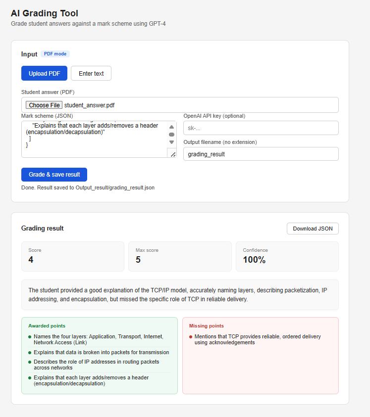

# AI-Grading-Tool

An intelligent, web-based exam grading system powered by Google Studion 2.5 Gemini AI. Automatically grade student answers against custom mark schemes with detailed feedback, point tracking, and confidence scores.

---

## Architecture

The system is built with:

- **Backend**: FastAPI (async Python web framework) made a very simple api to interact with a simple ui too
- **Frontend**: HTML5 with vanilla JavaScript **AI generated**
- **AI Engine**: Google Gemini 2.5 Flash API as it's the only one had free quota
- **PDF Processing**: pdfplumber for extracting data
- **Configuration**: Environment variables via `.env`

**Data Flow**:
```
User Input (PDF/Text)
    ↓
PDF Extraction (if PDF)
    ↓
Mark Scheme Loading
    ↓
Gemini API Grading
    ↓
JSON Parsing & Validation
    ↓
Result Display + File Save
```

---

## Installation

### Step 1: Clone or Download

```bash
git clone <repository-url>
cd AI\ Grading\ Sys
```

### Step 2: Install Dependencies

```bash
pip install -r requirements.txt
```

### Step 3: Get Google API Key

1. Visit [https://ai.google.dev/](https://ai.google.dev/)
2. Click **"Get API Key"**
3. Create a new API key (free tier)
4. Copy your API key

### Step 4: Configure Environment

Create a `.env` file in the project root:
GOOGLE_API_KEY= "your_api_key_here"

### Step 5: Verify Setup

```python
python
>>> import os
>>> from dotenv import load_dotenv
>>> load_dotenv()
>>> os.getenv("GOOGLE_API_KEY")
# Should print your API key (not None)
```

### Path Configuration

Update paths in `api/api.py` if needed:

```python
UI_PATH = r"F:/Omar 3amora/AI Grading Sys/UI/ui.html"
OUTPUT_DIR = r"F:/Omar 3amora/AI Grading Sys/Output_result"
```
Change these to your actual project paths.
---

## Usage

### Running the Server

```bash
uvicorn api.api:app --reload
```
Server will start at: **http://localhost:8000**

### Example Mark Scheme (JSON)

```json
{
  "topic": "Computer Science — Networking",
  "question": "Explain how the TCP/IP model works, including its layers and how data is transmitted.",
  "max_score": 5,
  "marking_points": [
    "Names the four layers: Application, Transport, Internet, Network Access (Link)",
    "Explains that data is broken into packets for transmission",
    "Describes the role of IP addresses in routing packets across networks",
    "Mentions that TCP provides reliable, ordered delivery using acknowledgements",
    "Explains that each layer adds/removes a header (encapsulation/decapsulation)"
  ]
}
```

---

## API Endpoints

### GET `/`
Returns the HTML interface.
**Response**: HTML page

---

### POST `/grade/pdf`
Grade a student's answer from a PDF file.
**Parameters**:
- `pdf` (file): PDF document containing the student answer
- `mark_scheme_json` (string): Mark scheme as JSON string
- `filename` (string): Output filename (default: "grading_result")

**Request Example**:
```bash
curl -X POST http://localhost:8000/grade/pdf \
  -F "pdf=@student_answer.pdf" \
  -F 'mark_scheme_json={"question":"...","max_score":5,"marking_points":["..."]}'
```

**Response**:
```json
{
  "score": 4,
  "max_score": 5,
  "feedback": "Strong answer with comprehensive understanding of TCP/IP.",
  "awarded_points": [
    "Names the four layers: Application, Transport, Internet, Network Access (Link)",
    "Explains that data is broken into packets for transmission"
  ],
  "missing_points": [
    "Mentions that TCP provides reliable, ordered delivery using acknowledgements"
  ],
  "confidence": 0.92
}
```

---

### POST `/grade/text`
Grade a student's answer from plain text.

**Parameters**:
- `answer` (string): Student's text answer
- `mark_scheme_json` (string): Mark scheme as JSON string
- `filename` (string): Output filename (default: "grading_result")

**Request Example**:
```bash
curl -X POST http://localhost:8000/grade/text \
  -F "answer=The TCP/IP model has four layers..." \
  -F 'mark_scheme_json={"question":"...","max_score":5,"marking_points":["..."]}'
```

**Response**: Same as `/grade/pdf`

---

## 📁 Project Structure

```
AI Grading Sys/
├── api/
│   ├── __init__.py
│   └── api.py                 # FastAPI application & endpoints
├── grading_api/
│   ├── __init__.py
│   └── llm_grading_api.py     # Gemini AI grading logic
├── answer_extractor/
│   ├── __init__.py
│   └── extractor.py           # Mark scheme handling
├── pdf_preprocessing/
│   ├── __init__.py
│   └── pdf_preprocessing.py   # PDF text extraction
├── UI/
│   └── ui.html                # Web interface
├── Input_files/
│   ├── mark_scheme.json       # Example mark scheme
│   └── student_answer.pdf     # Example student answer
├── Output_result/
│   └── grading_result.json    # Generated grading results
├── .env                       # Environment variables (create this)
├── .gitignore                 # Git ignore rules
├── requirements.txt           # Python dependencies
├── LICENSE                    # MIT License
├── README.md                  # This file
└── main.py                    # Entry point (optional)
```
---

## Security Notes

**Never commit `.env` file to Git!**

Add to `.gitignore`:
```
.env
*.env
__pycache__/
*.pyc
.DS_Store
```

**Keep API key private!**

Do NOT:
- Share your API key
- Commit it to version control
- Post it in forums/GitHub issues

---

## Results



---
